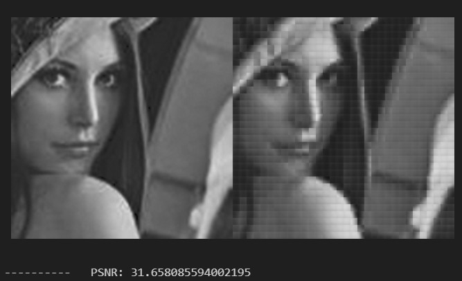
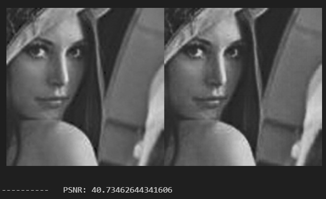

# Image_Compression_AutoEncoder_MLP_from_scratch

This repository contains the implementation and analysis of various multilayer perceptron (MLP) architectures for image compression and performance evaluation.

---

## Project Overview

This project focuses on:
- **Image Compression**: Using MLPs to compress and reconstruct grayscale images.
- **Performance Analysis**: Comparing results under different network configurations using metrics such as **PSNR (Peak Signal-to-Noise Ratio)** and **MSE (Mean Squared Error)**.

---

## Core Functions

### 1. **DataLoader**
- **Purpose**: Loads image data, preprocesses it into smaller \(8 \times 8\) blocks, and normalizes the pixel values for input to the autoencoder.
- **Functionality**:
  - Reads all `.jpg` images from the specified folder path.
  - Divides each image into \(8 \times 8\) blocks using the `MoveWindow` function.
  - Flattens and normalizes the blocks to have pixel values in the range \([0, 1]\).
- **Output**: A NumPy array of normalized pixel blocks for all images.
- **Usage**:
  ```python
  data = DataLoader("path/to/folder/")
  ```

### 2. **Reconstitution_img**
- **Purpose**: Reconstructs the \(256 \times 256\) image from the autoencoder's predicted \(8 \times 8\) blocks.
- **Functionality**:
  - Converts the predicted normalized pixel values back to integers in the range \([0, 255]\).
  - Groups the blocks into \(8 \times 8\) arrays and arranges them into a \(256 \times 256\) image.
  - Uses `vstack` and `hstack` for vertical and horizontal stacking of blocks.
- **Output**: A reconstructed image as a \(256 \times 256\) NumPy array.
- **Usage**:
  ```python
  reconstructed_img = autoencoder.Reconstitution_img(predicted_values)
  ```

### 3. **evaluate**
- **Purpose**: Evaluates the autoencoder's performance on a dataset of images.
- **Functionality**:
  - Iterates over all images in the dataset.
  - Predicts reconstructed images for each input using the `predict` method.
  - Computes performance metrics:
    - **PSNR** (Peak Signal-to-Noise Ratio)
    - **MSE** (Mean Squared Error)
  - Aggregates the metrics over all images.
- **Output**:
  - Average PSNR and MSE across all images.
  - Detailed evaluation info for each image: input, predicted output, PSNR, and MSE.
- **Usage**:
  ```python
  avg_psnr, avg_mse, eval_details = autoencoder.evaluate(test_data)
  ```

---

## PSNR Calculation

PSNR (Peak Signal-to-Noise Ratio) quantifies the quality of image reconstruction using the formula:

$\
PSNR = 10 \cdot \log_{10}\left(\frac{R^2}{MSE}\right)
\$

Where:
- \(R\) is the maximum possible pixel value, typically \(255\) for 8-bit images.

In this project:
- The pixel values of input images are normalized to \([0, 1]\) using the **sigmoid** activation function.
- Consequently, \(R\) is adjusted to \(1\) for PSNR calculations.

Example scaling and PSNR calculation:
```python
input = X.astype('float32') / 255  # Normalize input to [0, 1]
# PSNR calculation
psnr = 10 * np.log10(1 / mse)
```

This adjustment ensures consistency with the network's input scale.

---

## Evaluation Results

We trained and evaluated the MLP models under the following configurations:

### Optimizer: SGD
- **Training and Testing**:
  - Model with **32 hidden neurons**.
  - Model with **16 hidden neurons**.
  - Model with **4 hidden neurons**.

### Optimizer: Momentum (mu=0.8)
- **Training and Testing**:
  - Model with **32 hidden neurons**.
  - Model with **16 hidden neurons**.
  - Model with **4 hidden neurons**.

### Compression Results
The figures below demonstrate the compression results for:
1. A model with **4 hidden neurons**, trained with a learning rate of 0.01 and `SGD` optimizer.


3. A model with **64 hidden neurons**, trained with the same conditions.


---

## Reference Paper

For further insights into the theoretical foundation and methodologies applied in this project, refer to the following paper:

**"A Complexity-Based Approach in Image Compression using Neural Networks"**  
*Authors*: H. Veisi, M. Jamzad  
*Published*: 21 November 2009  
*Contact*: h.veisi@ut.ac.ir  

This paper is included in the repository and provides detailed discussions on this approach.
